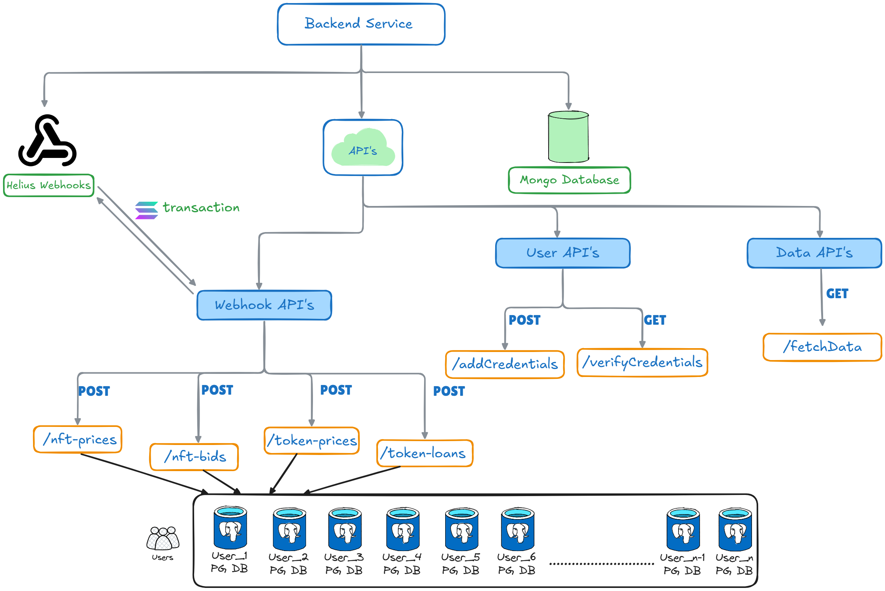
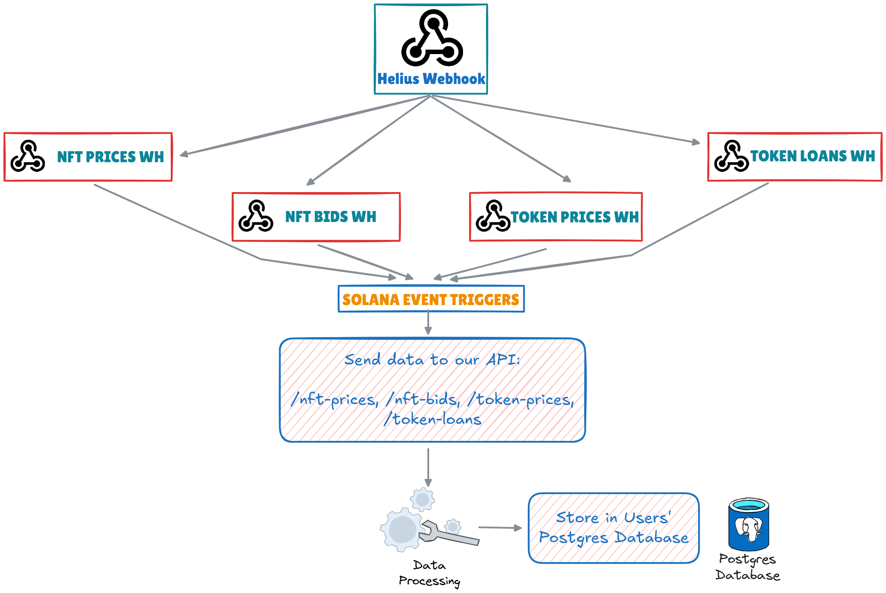

# Solantix

> A Solana NFT and Token Indexing Platform

## Overview
     

Solantix is a platform that allows users to index and monitor Solana NFT and token events using their own PostgreSQL database. The platform processes various blockchain events including NFT listings, sales, bids and token transfers.

## Features

- 🔄 Real-time NFT event monitoring
- 📊 Custom PostgreSQL integration
- 🎨 NFT collection tracking
- 💰 Token price monitoring
- 🔐 Secure GitHub authentication
- 📈 Interactive dashboard

# Solantix Backend Documentation

## Overview

The backend of Solantix is a Node.js-based application designed to handle Solana NFT and token indexing. It integrates with PostgreSQL databases for user-specific data storage and uses Helius webhooks for real-time blockchain event monitoring.


<p>
    
    <p align="center">Backend Architecture</p>
</p>

### Key Features
- **Webhook Integration**: Processes NFT and token events using Helius webhooks.
- **User-Specific Databases**: Each user can connect their PostgreSQL database for data storage.
- **Cache Service**: Optimizes API calls by caching frequently accessed data.
- **Batch Processing**: Buffers and processes data in batches for efficiency.
- **Error Handling**: Centralized error handling using custom `ApiError` and `asyncHandler`.

---

## Backend Architecture

### Folder Structure

```bash
backend/
├── src/
│   ├── app.js                # Express app setup
│   ├── index.js              # Entry point
│   ├── config/               # Configuration files
│   │   ├── index.js          # MongoDB connection
│   │   ├── webhookconfig.js  # Webhook configurations
│   ├── controllers/          # Route controllers
│   │   ├── fetchData.controller.js
│   │   ├── user.controller.js
│   │   ├── webhook.controller.js
│   ├── models/               # Mongoose schemas and helpers
│   │   ├── user.model.js
│   │   ├── userSchemaHelper.js
│   ├── routes/               # API routes
│   │   ├── fetchData.route.js
│   │   ├── user.route.js
│   │   ├── webhook.route.js
│   ├── services/             # Core services
│   │   ├── batch.service.js
│   │   ├── cache.service.js
│   │   ├── database.service.js
│   │   ├── initialise.service.js
│   │   ├── webhook.service.js
│   ├── utils/                # Utility functions
│   │   ├── ApiError.js
│   │   ├── asyncHandler.js
│   ├── constant.js           # Constants
├── .env                      # Environment variables
├── package.json              # Dependencies and scripts
```

---

## Services

### 1. **Webhook Service (`webhook.service.js`)**
Handles the initialization and management of Helius webhooks for different categories like NFT prices and token prices.
There are 4 global webhooks for handling each categories of solana transactions.

- **Functions**:
  - `initializeWebhooks()`: Initializes webhooks for all categories.
  - `createHeliusWebhook(config, apiKey)`: Creates a new webhook.
  - `checkWebhookExists(category, apiKey)`: Checks if a webhook already exists.

---

### 2. **Database Service (`database.service.js`)**
Manages PostgreSQL connection pools for each user and provides methods for executing queries and transactions.

- **Functions**:
  - `initialize()`: Initializes connection pools for all users.
  - `getPool(userId)`: Retrieves or creates a connection pool for a user.
  - `executeQuery(userId, query, params)`: Executes a query for a user.
  - `executeTransaction(userId, queryFn)`: Executes a transaction for a user.
  - `closeAllConnections()`: Closes all connection pools.

---

### 3. **Cache Service (`cache.service.js`)**
Caches frequently accessed data like NFT collection names to reduce API calls.

- **Functions**:
  - `initialize()`: Initializes the cache service.
  - `getNftCollection(nftAddress)`: Retrieves the NFT collection name from the cache or API.
  - `cleanupCaches()`: Removes expired cache entries.

---

### 4. **Batch Service (`batch.service.js`)**
Buffers data and processes it in batches to optimize database operations.

- **Functions**:
  - `initialize()`: Starts the batch processing service.
  - `addToBuffer(userId, category, data)`: Adds data to a buffer.
  - `flushBuffer(userId, category)`: Flushes a buffer to the database.
  - `flushAllBuffers()`: Flushes all buffers.

---

### 5. **Initialization Service (`initialise.service.js`)**
Handles the initialization and graceful shutdown of all services.

- **Functions**:
  - `initializeServices()`: Initializes database, batch, and cache services.
  - `gracefulShutdown()`: Cleans up resources during shutdown.

---

## Utilities

### 1. **`ApiError.js`**
Custom error class for handling API errors.

- **Properties**:
  - `statusCode`: HTTP status code.
  - `message`: Error message.
  - `errors`: Additional error details.

---

### 2. **`asyncHandler.js`**
Wrapper for handling asynchronous route handlers and catching errors.

---

<p>
    
    <p align="center">Working of Helius Webhook</p>
</p>

---

## Routes

### 1. **User Routes (`user.route.js`)**
- **`POST /api/user/addCredentials`**: Adds PostgreSQL credentials for a user.
- **`GET /api/user/verifyCredentials/:githubId`**: Verifies PostgreSQL credentials for a user.

---

### 2. **Webhook Routes (`webhook.route.js`)**
- **`POST /api/webhook/nft-prices`**: Processes NFT price events.
- **`POST /api/webhook/nft-bids`**: Processes NFT bid events.
- **`POST /api/webhook/token-prices`**: Processes token price events.
- **`POST /api/webhook/token-loans`**: Processes token loan events.

---

### 3. **Fetch Data Routes (`fetchData.route.js`)**
- **`GET /api/fetchData`**: Fetches indexed data for a user.

---

## Models

### 1. **User Model (`user.model.js`)**
Defines the schema for storing user information, including PostgreSQL configuration and indexing categories.

---

### 2. **User Schema Helper (`userSchemaHelper.js`)**
Provides helper functions for creating database schemas for users.

- **Functions**:
  - `createNftPricingSchema(pool, userId)`: Creates the `nft_prices` table for a user.

---

## Controllers

### 1. **User Controller (`user.controller.js`)**
Handles user-related operations like adding credentials and verifying them.

---

### 2. **Webhook Controller (`webhook.controller.js`)**
Processes incoming webhook events and saves data to user databases.

---

### 3. **Fetch Data Controller (`fetchData.controller.js`)**
Fetches indexed data from user databases.

---

## API Documentation

### User APIs
- **`POST /api/user/addCredentials`**: Adds PostgreSQL credentials for a user.
- **`GET /api/user/verifyCredentials/:githubId`**: Verifies PostgreSQL credentials for a user.

### Webhook APIs
- **`POST /api/webhook/nft-prices`**: Processes NFT price events.
- **`POST /api/webhook/nft-bids`**: Processes NFT bid events.
- **`POST /api/webhook/token-prices`**: Processes token price events.
- **`POST /api/webhook/token-loans`**: Processes token loan events.

### Data APIs
- **`GET /api/fetchData`**: Fetches indexed data for a user.

---

## Database Schema

### NFT Prices Table
```sql
CREATE TABLE nft_prices (
  id SERIAL PRIMARY KEY,
  transaction_id VARCHAR(88) NOT NULL UNIQUE,
  transaction_type VARCHAR(30) NOT NULL,
  nft_address VARCHAR(44) NOT NULL,
  nft_collection VARCHAR(100),
  seller_address VARCHAR(44),
  buyer_address VARCHAR(44),
  price_amount NUMERIC(20, 9) NOT NULL,
  marketplace VARCHAR(50)
);
```


---

## Getting Started

### Prerequisites

- Node.js v16+
- PostgreSQL database
- GitHub account
- Helius API keys

### Installation

1. Clone the repository
```bash
git clone https://github.com/yourusername/solantix.git
cd solantix
```

2. Install dependencies
```bash
# Install backend dependencies
cd backend
npm install

# Install frontend dependencies
cd ../frontend
npm install
```

3. Configure environment variables

Backend (.env):
```properties
MONGODB_URI=<MongoDB connection string>
PORT=5000
DB_NAME=solantix
WEBHOOK_BASE_URL=<Webhook base URL>
HELIUS_API_KEY_NFT_BID=<Helius API key for NFT bids>
HELIUS_API_KEY_TOKEN_LOAN=<Helius API key for token loans>
HELIUS_API_KEY_NFT_PRICE=<Helius API key for NFT prices>
HELIUS_API_KEY_NFT_LISTING=<Helius API key for NFT listings>
```

Frontend (.env.local):
```properties
NEXT_PUBLIC_API_URL=...
GITHUB_ID=...
GITHUB_SECRET=...
```

4. Start the development servers

```bash
# Start backend
cd backend
npm run dev

# Start frontend
cd frontend
npm run dev
```

---

## Contributing

1. Fork the repository
2. Create your feature branch (`git checkout -b feature/amazing-feature`)
3. Commit your changes (`git commit -m 'Add amazing feature'`)
4. Push to the branch (`git push origin feature/amazing-feature`)
5. Open a Pull Request


---


